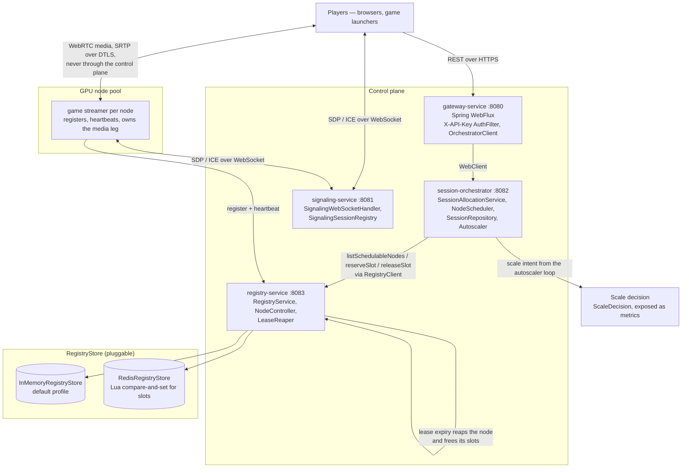
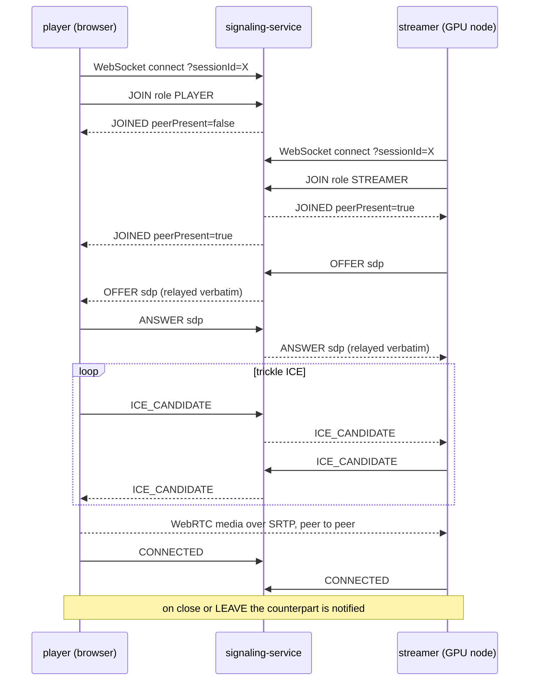
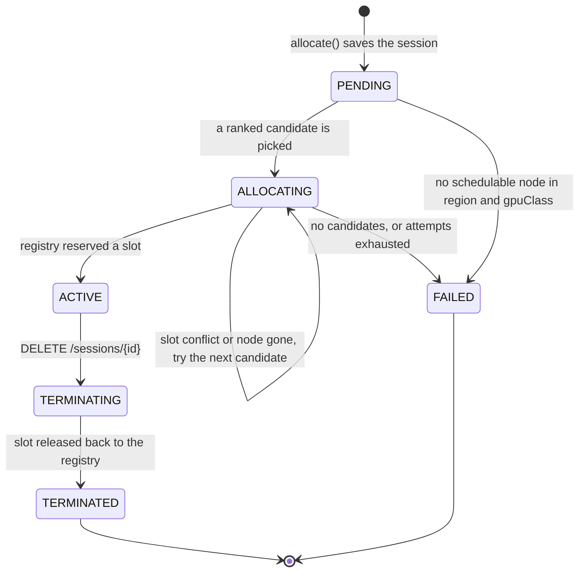

# CloudPlay — Game Streaming Orchestration Service

CloudPlay is a highly scalable, cloud-based game-streaming backend. It allocates
**GPU-backed game sessions** on demand, streams rendered video to players over
**WebRTC**, tracks node/session state in a **distributed registry** with
heartbeat leases, and **autoscales** the GPU pool to match live demand. It is
built as a set of **Java 17 / Spring Boot 3** microservices, packaged as Docker
images, and deployed to **Kubernetes** via **Terraform** Infrastructure-as-Code
on Linux.

> This repository is a realistic reference implementation: the control-plane
> services (allocation, registry, signaling, edge) are fully implemented; the GPU
> "streamer" (the process that captures and H.264/AV1-encodes the game and owns
> the WebRTC media leg) runs on the GPU nodes and is integrated via the registry
> + signaling protocols described below.

---

## Table of contents

- [Architecture](#architecture)
- [Microservices](#microservices)
- [REST API reference](#rest-api-reference)
- [WebRTC signaling flow](#webrtc-signaling-flow)
- [Session allocation algorithm](#session-allocation-algorithm)
- [Autoscaling](#autoscaling)
- [Distributed registry & leases](#distributed-registry--leases)
- [Project structure](#project-structure)
- [Build & run](#build--run)
- [Configuration](#configuration)

---

## Architecture



The **control plane** (gateway, orchestrator, registry, signaling) handles
allocation and negotiation. Once signaling completes, **media flows directly**
between the player and the GPU streamer over WebRTC — it never traverses the
signaling service.

---

## Microservices

| Service | Port | Stack | Responsibility |
|---|---|---|---|
| **gateway-service** | 8080 | Spring WebFlux | Public edge. Authenticates (`X-API-Key`), exposes one stable API, reactively proxies to the orchestrator. |
| **session-orchestrator** | 8082 | Spring Web (MVC) + WebClient | Core brain. Allocates sessions (queries registry → ranks nodes → atomic reserve → activate), manages lifecycle, runs the autoscaler. |
| **signaling-service** | 8081 | Spring WebSocket | WebRTC signaling: relays SDP offer/answer and ICE candidates between the player and the GPU streamer, keyed by `sessionId`. |
| **registry-service** | 8083 | Spring Web (MVC) | Distributed registry of GPU nodes & capacity with heartbeat leases and **atomic** slot reservation. Pluggable store (in-memory or Redis). |
| **common** | — | plain library | Shared DTOs, domain models, error envelope, and the reactive `RegistryClient`. Depended on by every service. |

---

## REST API reference

All public traffic goes through the **gateway** (`:8080`). The orchestrator and
registry endpoints are internal but documented for completeness. Requests to the
gateway (except `/actuator/**` and `/api/v1/public/**`) require an
`X-API-Key` header.

### Gateway (public)

| Method | Path | Description |
|---|---|---|
| `POST` | `/api/v1/sessions` | Allocate a GPU-backed session. Body: `SessionRequest`. → `201 SessionResponse` |
| `GET` | `/api/v1/sessions/{id}` | Fetch a session. → `200 SessionResponse` |
| `GET` | `/api/v1/sessions` | List sessions. → `200 [SessionResponse]` |
| `DELETE` | `/api/v1/sessions/{id}` | Terminate a session (releases its slot). → `202 SessionResponse` |
| `GET` | `/api/v1/nodes` | Operational view of the GPU node pool. → `200 [GpuNode]` |
| `GET` | `/api/v1/public/info` | Unauthenticated service info (signaling URL, auth flag). |
| `GET` | `/actuator/health` | Liveness/readiness. |
| `GET` | `/actuator/prometheus` | Prometheus metrics. |

### Session orchestrator (internal)

| Method | Path | Description |
|---|---|---|
| `POST` | `/api/v1/sessions` | Allocate (the real allocation logic). |
| `GET`/`DELETE` | `/api/v1/sessions/{id}` | Get / terminate. |
| `GET` | `/api/v1/nodes` | Node inventory (proxied from registry). |
| `GET` | `/api/v1/autoscaler/decisions` | Latest per-pool scale decisions. |

### Registry (internal)

| Method | Path | Description |
|---|---|---|
| `POST` | `/api/v1/nodes` | Node registers; returns a lease. Body: `NodeRegistration`. |
| `POST` | `/api/v1/nodes/{id}/heartbeat` | Renew lease + report load. Body: `HeartbeatRequest`. |
| `POST` | `/api/v1/nodes/{id}/reserve` | **Atomically** reserve a slot. Body: `SlotReservation`. |
| `POST` | `/api/v1/nodes/{id}/release` | Release a slot (idempotent). |
| `POST` | `/api/v1/nodes/{id}/cordon` | Drain a node ahead of scale-down. |
| `GET` | `/api/v1/nodes` | List nodes (`?region=&gpuClass=&schedulable=`). |
| `GET` | `/api/v1/nodes/{id}` | Get one node. |
| `DELETE` | `/api/v1/nodes/{id}` | Deregister. |

### Signaling (internal/edge)

| Protocol | Path | Description |
|---|---|---|
| `WebSocket` | `/signaling?sessionId={id}` | SDP/ICE relay endpoint. |
| `GET` | `/api/v1/signaling/stats` | Active signaling session count. |

### Example: allocate a session

```bash
curl -sS -X POST http://localhost:8080/api/v1/sessions \
  -H 'Content-Type: application/json' \
  -H 'X-API-Key: dev-key-local' \
  -d '{
        "userId": "u-123",
        "gameId": "cyber-racer",
        "region": "us-east-1",
        "gpuClass": "PERFORMANCE"
      }'
```

```json
{
  "sessionId": "sess-7f3a1b9c0d2e4a6b",
  "userId": "u-123",
  "gameId": "cyber-racer",
  "region": "us-east-1",
  "gpuClass": "PERFORMANCE",
  "state": "ACTIVE",
  "signalingUrl": "wss://signaling.cloudplay.example.com/signaling?sessionId=sess-7f3a1b9c0d2e4a6b",
  "streamerEndpoint": "10.42.3.17:50007",
  "createdAt": "2026-06-16T12:00:00Z",
  "updatedAt": "2026-06-16T12:00:00Z"
}
```

The client then opens the WebRTC signaling WebSocket at `signalingUrl`.

### Error envelope

Every service returns a uniform error body (`ApiErrorResponse`):

```json
{
  "timestamp": "2026-06-16T12:00:00Z",
  "status": 503,
  "code": "NO_CAPACITY",
  "message": "No GPU capacity available for region=us-east-1 gpuClass=PERFORMANCE",
  "path": "/api/v1/sessions"
}
```

---

## WebRTC signaling flow

The signaling service is a **stateless relay** keyed by `sessionId`. It pairs the
two peers — the **player** (browser) and the **streamer** (GPU node process) —
and forwards their SDP/ICE without inspecting it.



Message types (`SignalType`): `JOIN`, `JOINED`, `OFFER`, `ANSWER`,
`ICE_CANDIDATE`, `CONNECTED`, `LEAVE`, `ERROR`. The STREAMER is the offerer; the
PLAYER answers. Both trickle ICE candidates. On disconnect, the counterpart
receives a `LEAVE`.

Across multiple signaling replicas, ingress uses **sticky routing on
`sessionId`** (`sessionAffinity: ClientIP` + sticky ingress) so both peers of a
session land on the same pod, keeping the relay in-process.

---

## Session allocation algorithm

Implemented in `NodeScheduler` + `SessionAllocationService`:

1. **Query** the registry for schedulable nodes in the requested `region` with
   the requested `gpuClass` (`READY` + free slots).
2. **Rank** candidates by a **best-fit bin-packing** score: prefer the node that
   will be *most* utilized after placement. Consolidating load frees whole nodes
   for the autoscaler to reclaim (cheaper than spreading thin).
3. **Atomically reserve** a slot on the top candidate via the registry
   (`POST /nodes/{id}/reserve`). The registry uses **compare-and-set** semantics
   (a `ReentrantLock` in memory, or a **Lua script** on Redis) so two concurrent
   allocations can never oversubscribe the last slot.
4. On a **slot conflict** (lost CAS race) or a vanished node, **retry** with the
   next-best candidate, up to `maxAllocationAttempts`.
5. On success, mark the session `ACTIVE` and attach the streamer endpoint; if no
   candidate succeeds, mark `FAILED` and return `503 NO_CAPACITY`.

Session states: `PENDING → ALLOCATING → ACTIVE → TERMINATING → TERMINATED`
(with `FAILED` as the error terminal).



---

## Autoscaling

Two complementary layers:

**1. Pod autoscaling (HPA).** Each service has a `HorizontalPodAutoscaler`
(CPU-based; signaling additionally scales on the custom
`cloudplay_signaling_active_sessions` metric via the Prometheus Adapter).

**2. GPU node autoscaling (the orchestrator's `Autoscaler`).** Every
`evaluation-interval` it reads the live node inventory from the registry, groups
nodes into `(region, gpuClass)` pools, and computes a **desired node count**:

```
requiredSlots = ceil(usedSlots / targetUtilization) + warmSlotBuffer
desiredNodes  = clamp( ceil(requiredSlots / slotsPerNode), minNodes, maxNodes )
```

Scale-down is **rate-limited** (`maxScaleDownStep` per pass) to avoid thrash and
let in-flight sessions drain. Decisions are published as Micrometer gauges
(`cloudplay_autoscaler_desired_nodes`, `_current_nodes`, `_utilization`) tagged
by region/gpuClass. The orchestrator **expresses intent** rather than
provisioning VMs directly: the published metric (plus the streamer pods' GPU
resource requests) drives the **Kubernetes Cluster Autoscaler** to grow/shrink
the GPU managed node group provisioned by Terraform.

Worked example: pool with 7 used slots, target 0.70, buffer 2, 4 slots/node →
`ceil(7/0.70)+2 = 12` required slots → `ceil(12/4) = 3` desired nodes.

---

## Distributed registry & leases

- Nodes **register** (`POST /nodes`) and receive a **lease** with a TTL.
- Nodes **heartbeat** (`POST /nodes/{id}/heartbeat`) to renew the lease and
  report live load.
- A **lease reaper** scans on `reaper-interval`: a node past its lease becomes
  `UNHEALTHY`; after `decommission-grace` with no recovery it is removed.
- **Capacity** is tracked as session "slots"; `reserve`/`release` are atomic.
- The store is **pluggable** (`RegistryStore`):
  - `InMemoryRegistryStore` — single instance, per-node locks (default).
  - `RedisRegistryStore` — shared state across replicas; the reserve operation is
    a **Lua script** (read-check-write in one atomic Redis round-trip), giving
    etcd-style consistency without running etcd. Enabled via the `redis` profile.

---

## Project structure

```
cloudplay/
├── pom.xml                       # Maven aggregator (parent) — multi-module reactor
├── README.md
├── .gitignore
├── .env.example
├── common/                       # shared library (DTOs, models, errors, RegistryClient)
│   ├── pom.xml
│   └── src/main/java/com/cloudplay/common/
│       ├── dto/        (SessionRequest, SessionResponse, NodeRegistration, HeartbeatRequest, LeaseResponse, SlotReservation)
│       ├── model/      (GameSession, GpuNode, SessionState, NodeState, GpuClass)
│       ├── error/      (CloudPlayException, CommonExceptions, ApiErrorResponse, ErrorCode, ErrorResponses)
│       ├── registry/   (RegistryClient, RegistryClientProperties)
│       └── util/       (Ids)
├── registry-service/             # distributed registry (:8083)
│   ├── pom.xml  ├── Dockerfile
│   └── src/main/java/com/cloudplay/registry/
│       ├── controller/ (NodeController)
│       ├── service/    (RegistryService)
│       ├── store/      (RegistryStore, InMemoryRegistryStore, RedisRegistryStore)
│       ├── scheduler/  (LeaseReaper)
│       ├── config/     (RegistryProperties, RedisConfig)
│       └── exception/  (RegistryExceptionHandler)
├── session-orchestrator/         # allocation + autoscaler (:8082)
│   ├── pom.xml  ├── Dockerfile
│   └── src/main/java/com/cloudplay/orchestrator/
│       ├── controller/ (SessionController, NodeViewController)
│       ├── service/    (SessionAllocationService, SessionRepository)
│       ├── scheduler/  (NodeScheduler)
│       ├── autoscaler/ (Autoscaler, ScaleDecision)
│       ├── config/     (OrchestratorProperties, OrchestratorConfig)
│       └── exception/  (OrchestratorExceptionHandler)
├── signaling-service/            # WebRTC signaling (:8081)
│   ├── pom.xml  ├── Dockerfile
│   └── src/main/java/com/cloudplay/signaling/
│       ├── handler/    (SignalingWebSocketHandler)
│       ├── service/    (SignalingSessionRegistry, SignalingSession)
│       ├── model/      (SignalMessage, SignalType, PeerRole)
│       ├── config/     (WebSocketConfig, SessionHandshakeInterceptor)
│       └── controller/ (SignalingStatusController)
├── gateway-service/              # public edge (:8080)
│   ├── pom.xml  ├── Dockerfile
│   └── src/main/java/com/cloudplay/gateway/
│       ├── controller/ (GatewaySessionController, GatewayNodeController, PublicController)
│       ├── client/     (OrchestratorClient)
│       ├── filter/     (AuthFilter)
│       ├── config/     (GatewayProperties, GatewayConfig)
│       └── exception/  (GatewayExceptionHandler)
└── deploy/
    ├── k8s/            # Namespace, ConfigMap/Secret, Deployments, Services, HPAs, Redis
    └── terraform/      # EKS cluster + system & GPU node groups (main/variables/outputs)
```

---

## Build & run

> **The commands below are documented for reference. This repo is a no-execution
> reference workspace — do not assume anything has been built or run here.**

### Prerequisites
- JDK 17, Maven 3.9+
- Docker (for images), kubectl + a cluster, Terraform 1.5+, AWS CLI (for EKS)

### Build all modules

```bash
# From the repo root — builds common first, then all services (reactor order).
mvn clean package

# Build a single service and its module dependencies:
mvn -pl session-orchestrator -am clean package
```

### Run locally

```bash
# In-memory registry (no Redis needed):
java -jar registry-service/target/registry-service.jar          # :8083
java -jar session-orchestrator/target/session-orchestrator.jar  # :8082
java -jar signaling-service/target/signaling-service.jar        # :8081
java -jar gateway-service/target/gateway-service.jar            # :8080

# Distributed registry with Redis:
docker run -p 6379:6379 redis:7-alpine
SPRING_PROFILES_ACTIVE=redis java -jar registry-service/target/registry-service.jar
```

### Build Docker images

```bash
# Each Dockerfile is multi-stage; build from the repo root so the build stage
# can see the full reactor.
docker build -f registry-service/Dockerfile      -t ghcr.io/cloudplay/registry-service:1.0.0 .
docker build -f session-orchestrator/Dockerfile  -t ghcr.io/cloudplay/session-orchestrator:1.0.0 .
docker build -f signaling-service/Dockerfile     -t ghcr.io/cloudplay/signaling-service:1.0.0 .
docker build -f gateway-service/Dockerfile       -t ghcr.io/cloudplay/gateway-service:1.0.0 .
```

### Provision infrastructure (Terraform → EKS)

```bash
cd deploy/terraform
cp terraform.tfvars.example terraform.tfvars   # edit as needed
terraform init
terraform plan
terraform apply
aws eks update-kubeconfig --region us-east-1 --name cloudplay
```

### Deploy to Kubernetes

```bash
# Apply in order (numeric filename prefixes encode dependency order).
kubectl apply -f deploy/k8s/00-namespace.yaml
kubectl apply -f deploy/k8s/01-configmap.yaml
kubectl apply -f deploy/k8s/20-redis.yaml
kubectl apply -f deploy/k8s/

kubectl -n cloudplay get pods,svc,hpa
kubectl -n cloudplay get svc gateway-service   # external LoadBalancer address
```

---

## Configuration

Key settings (all overridable via environment variables; see `.env.example`):

| Property | Service | Default | Purpose |
|---|---|---|---|
| `cloudplay.gateway.auth.api-keys` | gateway | `dev-key-local` | Accepted `X-API-Key` values. |
| `cloudplay.gateway.orchestrator-url` | gateway | `http://session-orchestrator:8082` | Upstream orchestrator. |
| `cloudplay.orchestrator.registry.base-url` | orchestrator | `http://registry-service:8083` | Registry endpoint. |
| `cloudplay.orchestrator.autoscaler.target-utilization` | orchestrator | `0.70` | Target steady-state node utilization. |
| `cloudplay.orchestrator.autoscaler.slots-per-node` | orchestrator | `4` | Sessions per GPU node. |
| `cloudplay.registry.lease-ttl` | registry | `30s` | Heartbeat lease TTL. |
| `cloudplay.registry.decommission-grace` | registry | `2m` | Grace before removing a dead node. |
| `cloudplay.signaling.allowed-origins` | signaling | `*` | CORS origin patterns for the WS. |
| `SPRING_PROFILES_ACTIVE=redis` | registry | _(off)_ | Switch to the distributed Redis store. |

---

## License

Reference implementation for portfolio / planning purposes.
